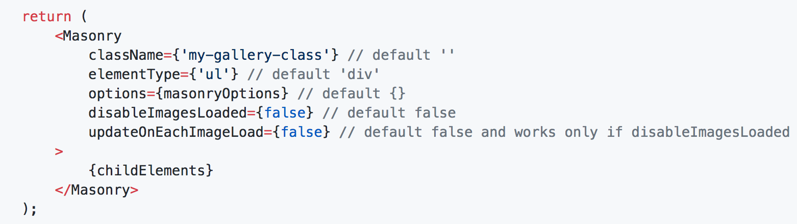
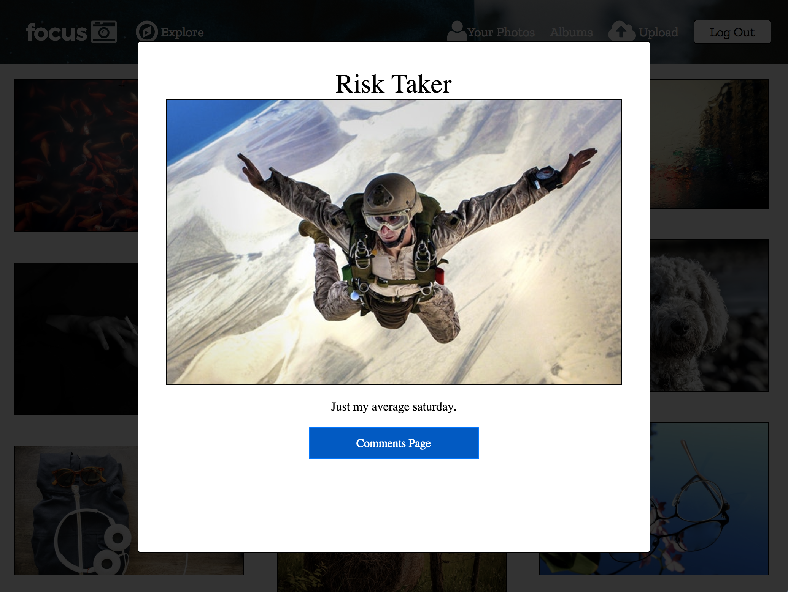

# Focus

[Focus Website](https://focusthis.herokuapp.com/#/)

Focus is a full-stack web application inspired by Flickr that utilizes:
- A Ruby on Rails backend
- A PostgreSQL database
- React.js with a Redux architectural framework on the fontend.

## Features and Implementation
### Photos
Using the [React Masonry Component](https://github.com/eiriklv/react-masonry-component), photos are displayed as a responsive gallery that rearrange according to the size of the window.

Using the [React Modal](https://github.com/reactjs/react-modal), photos are displayed in a convenient pop-up that zooms in on the photo.

## Future Direction for Project

In the future I plan to add the following to add functionality similar to Flickr:
- Clickable tags that direct you to a show-page full of photos with those tags.
- Clickable photo display that links to comments and tags section.
